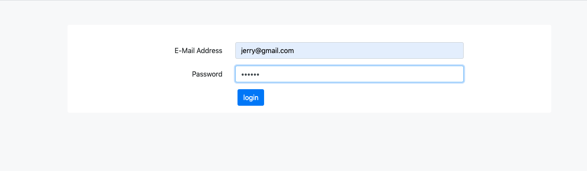
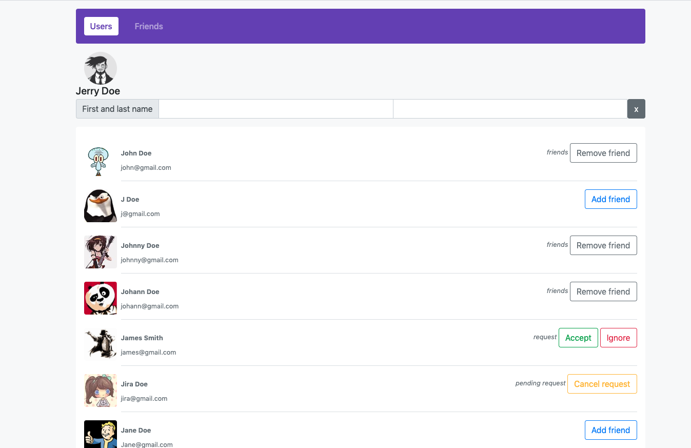
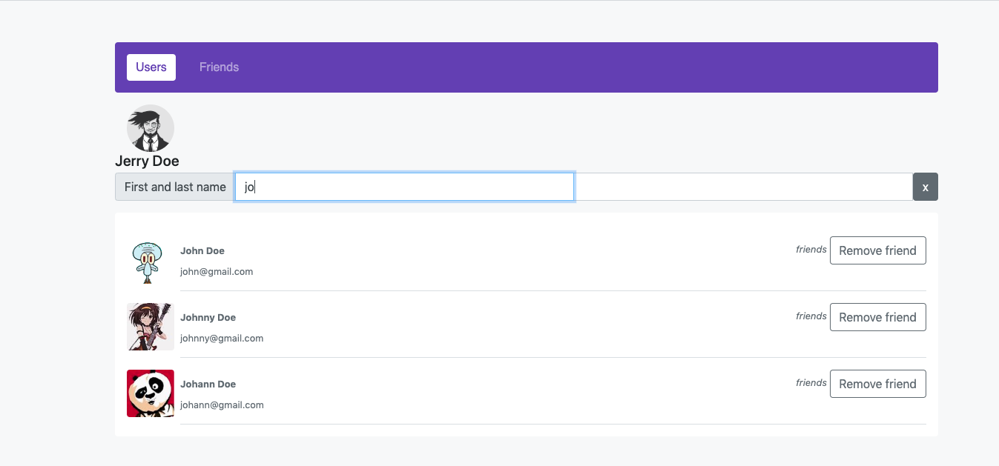
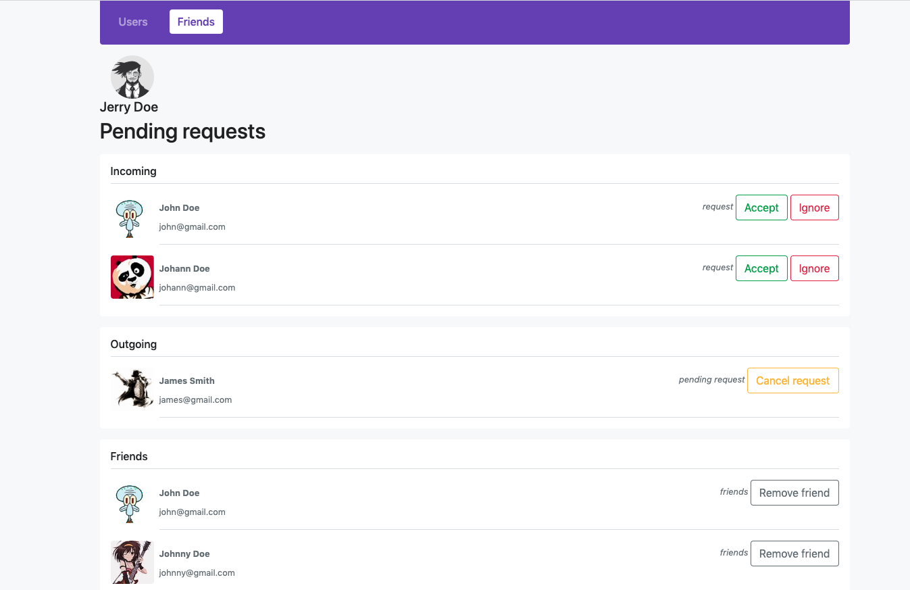

# Social Network

## About
This project - Rest api aplication on express

## Start
1. Install packages: `npm i `

2. Run aplication `npm start`
   
3. Build aplication `npm build`

aplication is running on <i>`http://localhost:4200`</i> 
 - Port can change in webpack.config -  
  ` devServer: {
    port: 4200
  } ` 
 - Api adress can change in `/const/const.js` API_URL: <i>`http://localhost:3000/`</i>

## Tests users:
1. `jerry@gmail.com`
2. `j@gmail.com`
3. `johnny@gmail.com`
4. `johann@gmail.com`
5. `james@gmail.com`
6. `jira@gmail.com`
7. `john@gmail.com`
8. `Jane@gmail.com` 

    password is `123123`

### Login Page

### Users Page

### Friends Page

